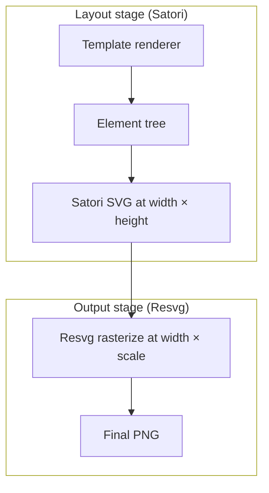

The `scale` option controls **PNG rasterization quality** via Resvg. It does **not** change the layout space that Satori uses. Templates should always design against the original `width` and `height` — never multiply dimensions or font sizes by `scale`.

<Warning>
  **Do not use `scale` for layout.** Satori always renders at `width × height` (default 1200 × 630). Only Resvg uses `scale` to produce a higher-resolution PNG from the same SVG.
</Warning>

## Two-Stage Rendering



| Stage | Engine | Dimensions | What it affects |
|-------|--------|------------|-----------------|
| Layout | Satori | `width × height` | Font sizes, padding, flex layout, positioning |
| Output | Resvg | `width × scale` × `height × scale` | PNG pixel density, sharpness |

From `renderTemplate`:

```typescript
// Satori — always original dimensions
const svg = await satori(element, {
  width,   // e.g. 1200 — NOT scaled
  height,  // e.g. 630  — NOT scaled
  fonts,
  ...
});

// Resvg — scale applied here only
const pngData = await renderAsync(svg, {
  fitTo: {
    mode: "width",
    value: Math.round(width * scale),  // e.g. 2400 when scale=2
  },
});
```

## What `scale` Does and Does Not Do

<AccordionGroup>
  <Accordion icon="check" title="scale DOES">
    - Increase final PNG pixel dimensions (`width × scale`, `height × scale`)
    - Improve text sharpness and edge anti-aliasing on retina displays
    - Increase output file size (roughly proportional to `scale²`)
  </Accordion>

  <Accordion icon="xmark" title="scale does NOT">
    - Change `width` / `height` passed to your template renderer
    - Affect font sizes, padding, margins, or gap values in Satori
    - Require template code changes when callers request higher quality
  </Accordion>
</AccordionGroup>

## Correct vs Incorrect Usage

<CodeGroup>

```tsx Correct — layout uses width/height only
renderer: ({ params, width, height }) => (
  <div
    tw="flex flex-col w-full h-full p-16"
    style={{ width, height }}  // always 1200 × 630
  >
    <div tw="text-[64px] font-bold">{params.title}</div>
  </div>
),
```

```tsx Wrong — do not multiply by scale
renderer: ({ params, width, height, scale }) => (
  <div style={{
    width: width * scale,   // ❌ breaks layout
    height: height * scale, // ❌ breaks layout
  }}>
    <div style={{ fontSize: 64 * scale }}>  {/* ❌ */}
      {params.title}
    </div>
  </div>
),
```

```typescript Correct — pass scale at render time
// Template code stays the same regardless of scale
const buffer = await renderer.renderToImage(
  "basic",
  { title: "Sharp Retina Image" },
  { scale: 2 }  // ✅ only here
);
```

</CodeGroup>

## Output Dimensions

Base canvas: **1200 × 630** (Open Graph standard).

| `scale` | Output PNG | Use case |
|---------|-----------|----------|
| `1` *(default)* | 1200 × 630 | Standard, smallest file size |
| `1.25` | 1500 × 787 | Mild quality boost |
| `1.5` | 1800 × 945 | Good quality / size balance |
| `2` | 2400 × 1260 | **Recommended** — @2x retina |
| `3` | 3600 × 1890 | @3x ultra |
| `4` | 4800 × 2520 | Maximum (clamped) |

## Constraints

- **Float values** supported: `1.25`, `1.5`, `2`, etc.
- **Clamped to `[1, 4]`** — values below `1` become `1`, above `4` become `4`
- **File size** grows roughly with `scale²` (e.g. `scale: 2` ≈ 4× larger PNG)
- **`scale` is passed to the renderer** for awareness but must be ignored for layout

## Examples

<CodeGroup>

```typescript Default (no supersampling)
const buffer = await renderer.renderToImage("basic", {
  title: "Standard Quality",
});
// → 1200 × 630 PNG
```

```typescript @2x Retina (recommended)
const buffer = await renderer.renderToImage(
  "basic",
  { title: "Sharp Retina Image" },
  { scale: 2 }
);
// → 2400 × 1260 PNG, same layout as scale=1
```

```typescript Fine-grained float
const buffer = await renderer.renderToImage(
  "basic",
  { title: "Quality Boost" },
  { scale: 1.5 }
);
// → 1800 × 945 PNG
```

```typescript Combined with custom dimensions
const buffer = await renderer.renderToImage(
  "basic",
  { title: "Twitter Card" },
  {
    width: 1600,
    height: 900,
    scale: 2,
  }
);
// Satori layout: 1600 × 900
// PNG output: 3200 × 1800
```

</CodeGroup>

## Why This Design?

Satori calculates layout using absolute pixel values (`text-[64px]`, `p-16`, etc.). If `scale` changed the layout space, every font size and spacing value would need manual adjustment.

By keeping Satori at the original dimensions and upscaling only at rasterization:

1. **Templates are scale-agnostic** — write once, render at any quality
2. **Font sizes stay correct** — `64px` always means 64 layout pixels
3. **Vector SVG scales cleanly** — Resvg rasterizes the same SVG at higher resolution without layout drift

<Tip>
  Use `scale: 2` in production for retina-quality OG images. The template code
  does not need to change — only the `renderToImage` options.
</Tip>
